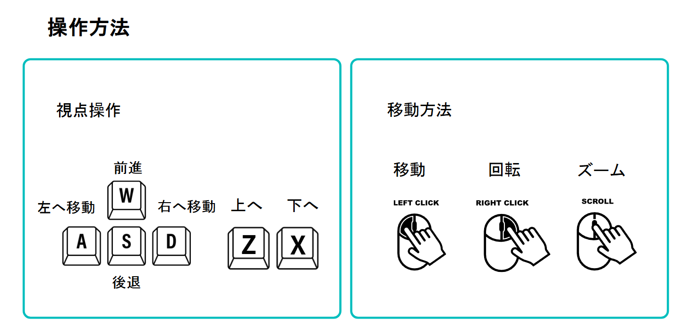
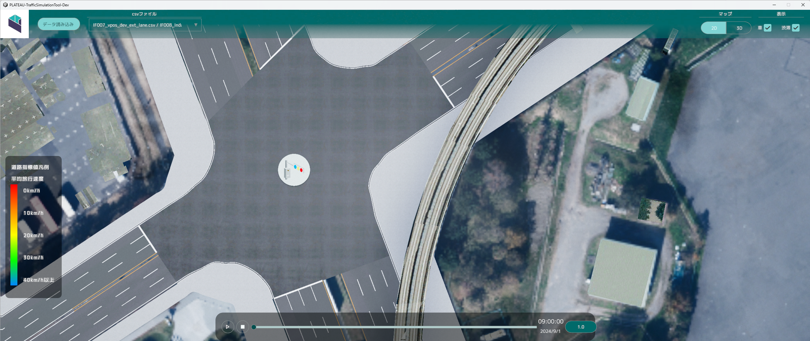
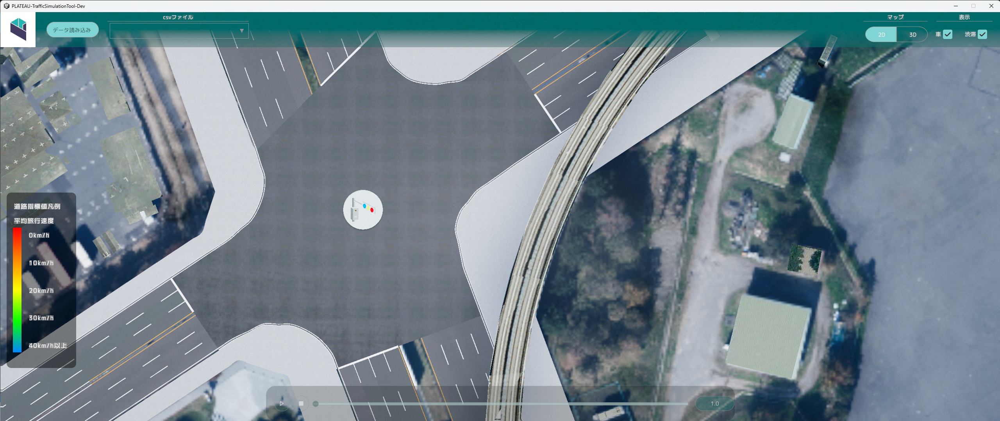

# 基本操作

本ツールでは、シミュレーション結果を3Dおよび2Dで可視化する機能を提供します。

ランタイム環境（デバッグプレイ・スタンドアロンビルド）にてシミュレーションデータをロードすることで、時間経過に応じた車両の動きや道路の混雑状況をリアルタイムで表示できます。

## 事前準備

- シミュレーション用データの作成

    本書の手順に従い 道路ネットワークデータ・信号現示データ・既存OD交通量データ・開発OD交通量データ を作成します。

- シミュレーションの実行

    Avenue等の交通シミュレータを用いて シミュレーションを行い、可視化用の 車両位置情報データ・道路指標値データ を出力します。

- シミュレーションの可視化

    Unityのプレイボタン押し可視化ツールを実行します。

## 操作説明

### 視点操作

- 通常時、マウスとキーボードを使用してカメラを操作することができます。

- マップを左クリックでドラッグしながら動かすことで、視点を水平に移動させることができます。

- WASD キーでも、視点を水平に移動させることができます。

- マップを右クリックでドラッグすることで、右クリックした場所を中心として視点を回転させることができます。

- X キーで視点を下げ、Z キーで視点を上げることができます。

- 前方スクロールすることでズームイン、後方スクロールすることでズームアウトすることができます。

### シミュレーションデータ読み込み

車両位置データおよび道路指標値データを読み込むことでシミュレーションデータ再生機能が使用できるようになります。

- `データ読み込み`をクリックするとファイル読み込みウィンドウが表示されます。

  - 車両位置情報データ
    
    `選択`をクリックし車両位置情報データを指定します。

  - 道路指標値データ
    
    `選択`をクリックし道路指標値データを指定します。

  `読み込み`をクリックするとデータが読み込まれます。

### シミュレーションデータ切り替え機能

データ読み込みで読み込まれたファイルがリストへ自動で追加されます。

リストからデータを選択するとデータを切り替えることができます。

### シミュレーションデータ再生機能

シミュレーションを再生することができます。

シミュレーションでは時間に応じた車の表示および渋滞状況のヒートマップが表示されます。

- 再生ボタンをクリックするとシミュレーションが開始されます。

- 停止ボタンをクリックするとシミュレーションが停止します。

- スライダーを変更することで、再生する時間帯を変更できます。

- スライダー右の再生速度ボタンをクリックするとリストが表示され、

  リストから倍率選択するとシミュレーションの再生速度を変更することができます。

#### 車の表示

車両位置情報データに基づき車両の表示を行います。

車両は小型車両、小型車両（開発エリアに発着）、大型車両の区分でビジュアルが異なります。

#### 渋滞の表示

道路指標値データに基づいたヒートマップの表示を行います。

道路指標値とは、交通シミュレーションで算出される混雑度や交通流量の指標です。

これをもとに道路の混雑状況を左下の凡例に基づきヒートマップとして可視化します。

### 2D/3D切り替え機能

表示切り替えトグルを切り替えることで表示を切り替えることができます。

- 2D

  

- 3D

  

### 表示切り替え機能

車両および道路指標値の表示の有効化・無効化を行うことができます。

- 車

  

- 渋滞

  

### ハイライト機能

開発エリアに発着する車両のみを強調表示します。

- 開発エリアをクリックするとハイライトされ、再度開発エリアをクリックすると表示が戻ります。