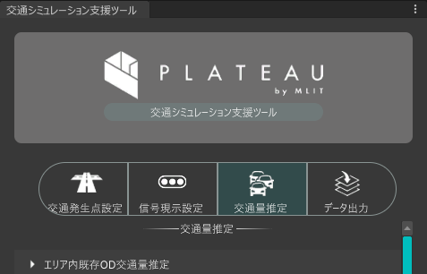

# エリア内既存OD交通量推定

本機能は、ゾーンに属する建物の用途別延べ床面積およびシミュレーション条件から発生集中原単位を算出し、ゾーンごとの車両の発生集中量を推定する機能です。

算出されたデータは、既存OD交通量ファイルとして出力され、シミュレーションの基礎データとして利用されます。

## 事前準備

シミュレーション用道路ネットワークがデータ出力機能で出力されていること。

断面交通量データおよび交差点交通量データを用意すること。

## 利用手順

### 入出力設定

- 道路ネットワーク参照フォルダ

  [データ出力機能](../manual/Export.md)で出力したシミュレーション用道路ネットワークが格納されたファイルを指定します。

- 観測交通量参照フォルダ

  断面交通量データ・交差点交通量データが格納されたファイルを指定します。

- 既存OD交通量出力フォルダ

  既存OD交通量ファイルの出力先を指定します。

  

### シミュレーション条件設定

- シミュレーション日
- 発生集中原単位（業務施設）
- 発生集中原単位（商業施設）
- 自動車分担率

  シミュレーション条件を選択することで建築物の種別に応じた発生集中原単位、自動車分担率、台換算係数がプリセットされます。

  また、直接値を指定することも可能です。

- 集中時間帯係数
- 発生時間帯係数
  
  時間ごとの交通量の比率をスライダーで時間ごとに設定することができます。

  

### シミュレーション時刻設定

- シミュレーション開始時刻

  シミュレーション開始時刻を設定します。

- シミュレーション終了時刻

  シミュレーション終了時刻を設定します。

  

### 実行

`実行`をクリックすることでシミュレーション条件をもとに推定され出力されます。

  