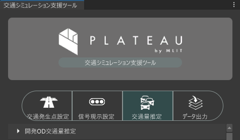
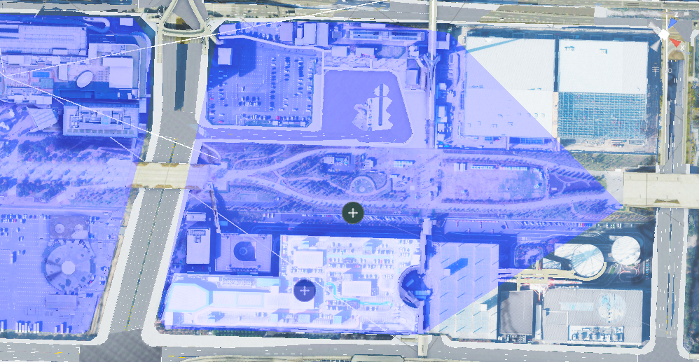
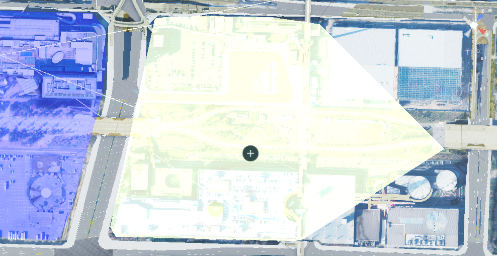
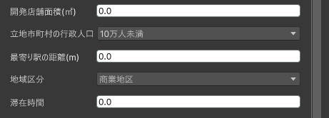
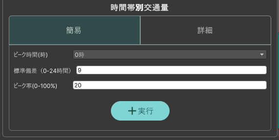
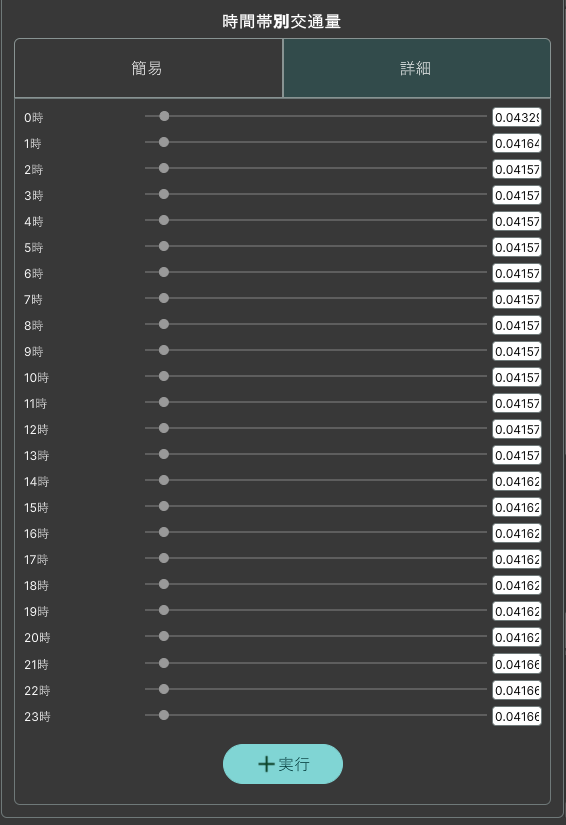

# 開発OD交通量推定

本機能は、開発エリアおよび開発条件を指定し、開発エリアに係る発生集中量を推定し、開発OD交通量ファイルを出力する機能です。

## 事前準備

既存OD交通量推定機能で出力したデータが存在すること。

開発エリアのゾーン情報を用意しておくこと。

## 利用手順

### 開発エリアの設定

開発エリアを指定します。

- 開発ゾーンの指定

  `開発ゾーン指定`をクリックし、シーンビュー上で開発ゾーンとするゾーンをクリックします。
  
  

  

- 参照ゾーン

  `参照ゾーン指定`をクリックし、シーンビュー上で開発ゾーンが所属するゾーンをクリックします。

  

  

- 既存OD交通量参照フォルダ
  
  `読み込み`をクリックし、[既存OD交通量推定機能](../manual/CurrentEstimation.md)で出力した既存OD交通量ファイルが格納されたフォルダを指定します。

  指定したフォルダが開発OD交通量の出力先にもなります。
  
  

### 開発条件の設定

開発エリアの条件を指定します。

  - 開発店舗面積
  - 立地市町村の行政人口
  - 最寄り駅の距離
  - 地域区分
  - 滞在時間

  

### 時間帯別交通量設定

時間帯別の交通量は、簡易設定と詳細設定の2通りの方法で指定できます。

- 簡易
  
  時間ごとの交通量の比率をガウス分布により設定できます。

  - ピーク時間
  - 標準偏差
  - ピーク率

  

- 詳細
  
  時間ごとの交通量の比率をスライダーで時間ごとに細かく設定できます。

  スライドバーを操作または数値を入力します。

  

### 実行

実行 をクリックすると、設定したシミュレーション条件に基づいて推定が行われ、開発OD交通量データが出力されます。