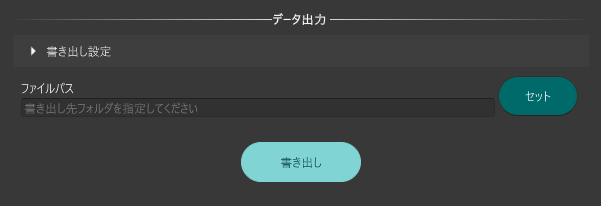

# データ出力

本機能は、シミュレーション用の道路ネットワークデータおよび信号現示設定データを出力するための機能です。

## 事前準備

シミュレーション用道路ネットワークと信号現示設定が適切に設定されていること。

## 利用手順

### 出力先の指定

`セット`をクリックし、出力先フォルダを指定します。

  

### データの書き出し

`書き出し`をクリックすると出力先フォルダへファイルが出力されます。