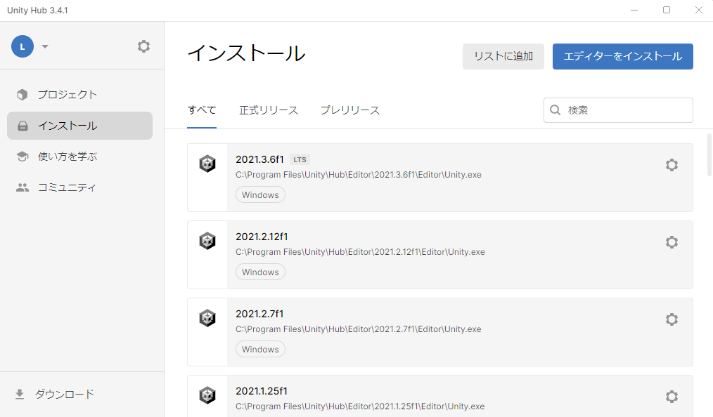

# セットアップの手順

本書では、ツールのセットアップ手順について記載しています。

## Unityのダウンロードとインストール
- Unity Hub を[こちら](https://unity3d.com/jp/get-unity/download)からインストールします。
- Unity Hub とは、Unityの任意のバージョンをインストールして起動することのできるソフトウェアです。
- Unity Hubを起動し、左のサイドバーからインストール → 右上のボタンからエディターをインストール をクリックします。

Unity 2022.3 で始まるバージョンを選択し、インストールを押します。

## Unityプロジェクトを作成
Unity Hub を起動します。

左サイドバーの `プロジェクト` を押し、右上の `新しいプロジェクト` ボタンをクリックします。

新しいプロジェクトの設定画面で、次のように設定します。
- 画面上部の `エディターバージョン` を `2022.3` で始まる番号にします。
- 画面中部の `テンプレート` は `High Definitaion 3D` を選択します。
- 画面右下のプロジェクト名を任意の名前にに設定します。
- `プロジェクトを作成` ボタンを押します。

## ツールをUnityにインポート

- 作成したプロジェクトをクリックすると、Unityが起動します。
- Unityが起動したら、以下の各ツールのリリースページからtgzファイルをダウンロードします。
  - [PLATEAU SDK for Unityのリリースページ](https://github.com/Project-PLATEAU/PLATEAU-SDK-for-Unity/releases)
  - [PLATEAU-SDK-Toolkits-for-Unityのリリースページ](https://github.com/Project-PLATEAU/PLATEAU-SDK-Toolkits-for-Unity/releases)
  - [交通シミュレータのリリースページ](https://github.com/Project-PLATEAU/Data-Preparation-Tool-for-TrafficSim/releases)

> [!NOTE]  
> git指定で導入する方法は以下を参考にしてください。 
> [SDKの使い方:GitのURL指定で導入する方法](https://project-plateau.github.io/PLATEAU-SDK-for-Unity/manual/Installation.html#git%E3%81%AEurl%E6%8C%87%E5%AE%9A%E3%81%A7%E5%B0%8E%E5%85%A5%E3%81%99%E3%82%8B%E6%96%B9%E6%B3%95)

- ダウンロードできたら、Unityのメニューバーから `Window` → `Package Manager` を選択します。
- Package Manager ウィンドウの左上の `＋` ボタンから `Add pacakge from tarball...` を選択します。

- 先ほどダウンロードした 各ツールの tgz ファイルを指定します。するとウィンドウのパッケージ一覧に各ツール名が表示されます。

- すべてのツールを導入したら、Package Manager ウィンドウを閉じます。

## 道路ネットワークの準備

PLATEAU SDK for Unityにてシミュレーション対象エリアの都市モデルをインポートします。

  - [PLATEAU SDK for Unity 3D都市モデルのインポート](https://project-plateau.github.io/PLATEAU-SDK-for-Unity/manual/ImportCityModels.html)

PLATEAU SDK for Unityにて道路ネットワークを生成し、車線数や一方通行など実際の道路に即したネットワークへ編集します。

  - [PLATEAU SDK for Unity 道路ネットワークの利用](https://project-plateau.github.io/PLATEAU-SDK-for-Unity/manual/RoadNetwork.html)

## シミュレーション用データの作成からシミュレーション結果可視化の手順

シミュレーションを実行し、可視化するためのデータ準備は以下の手順で進めます。

1. `IF001` `IF002` `IF003`を利用して道路ネットワークを作成する（前項：道路ネットワークの準備）。
1. [交通集中発生点設定機能](../manual/ZoneSetting.md)および [信号現示設定機能](../manual/SignalSetting.md)にて道路ネットワークと`IF004`をもとにシミュレーション用道路ネットワークを生成する。
1. [データ出力機能](../manual/Export.md)にて`IF101` `IF102`を出力する。
1. 実地での観測結果やオープンデータをもとに`IF005` `IF006`を作成する。
1. [既存OD交通量推定機能](../manual/CurrentEstimation.md)および[開発OD交通量推定機能](../manual/DevelopEstimation.md)にて`IF101` `IF005` `IF006`をもとに`IF103` `IF104`を出力する。
1. Avenue等の交通シミュレータにて`IF101` `IF102` `IF103` `IF104`をもとにシミュレーションを行い、可視化用の`IF007` `IF008`を出力する
1. ランタイム環境（デバッグプレイ・スタンドアロンビルド）にて`IF007` `IF008`を動的にロードし、シミュレーションを可視化する。

|ID|データ概要|ファイル形式|ファイル名 `*はファイル名不定`|ファイル概要|
|:--|--:|:--:|:--:|:--:|
|IF001|都市モデル地形データ|CityGML|`*`dem.gml|都市モデル地形地形情報|
|IF002|都市モデル道路データ|CityGML|`*`tran.gml|都市モデル地形道路情報|
|IF003|都市モデル建築物データ|CityGML|`*`bldg.gml|都市モデル建築物情報|
|IF004|信号現示データ|CSV|`*`警視庁_定義_yyyymm.csv `*`警視庁_制御_yyyymm.csv|信号定義情報（オープンデータ） 信号制御情報（オープンデータ）
|IF101|シミュレーション用道路ネットワークデータ|GeoJSON|output_node.geojson output_link.geojson output_lane.geojson output_track.geojson output_zone.geojson|交差点情報 道路情報 車線情報 交差点軌跡情報 ゾーン情報|
|IF102|シミュレーション用信号現示データ|GeoJSON|output_signalcontroler.geojson output_signallight.geojson output_signalstep.geojson|信号制御器情報 信号灯火器情報 信号現示階梯情報
|IF005|断面交通量データ|CSV|IF105_lk.csv|断面交通量情報|
|IF006|交差点交通量データ|CSV|IF106_crs.csv|交差点交通量情報|
|IF103|既存OD交通量データ|CSV|IF103_estgnr.csv|既存OD交通量情報|
|IF104|開発OD交通量データ|CSV|IF104_dev.csv|開発OD交通量情報|
|IF007|車両位置情報データ|CSV|`*`IF007_vpos.csv|車の時系列位置情報|
|IF008|道路指標値データ|CSV|`*`IF008_Indactor.csv|渋滞の時系列指標値情報|
