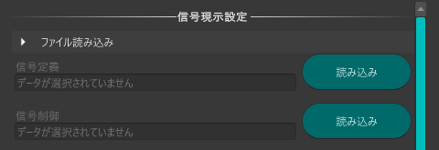
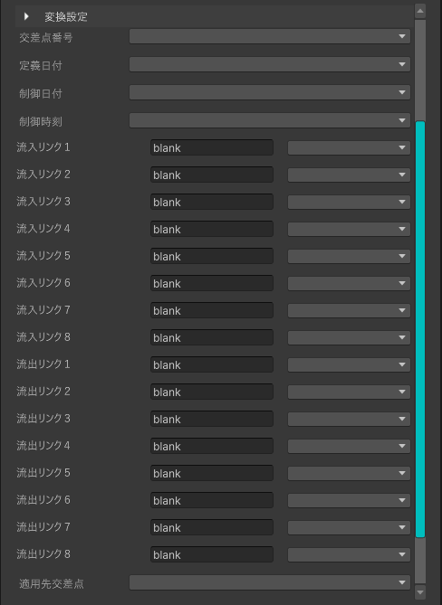

# 信号現示設定

本機能は、シミュレーション範囲内の交差点に適用する信号制御情報を設定するための機能です。

オープンデータの交差点制御情報を取り込み、PLATEAU Toolkitの交通シミュレータに適用可能な形式へ変換します。

## 事前準備

事前にPLATEAU Toolkitを導入し、交通シミュレータを配置しておく必要があります。

信号の位置は[JTMTA](https://www.tmt.or.jp/research/index10.html)の交差点の位置情報等の提供から確認できます。

交差点制御情報は[JARTIC](https://www.jartic.or.jp/service/opendata/#typeC)から取得できます。

## 利用手順

### ファイル読み込み

- 信号定義

  `読み込み`をクリックし、信号定義データを指定します。

- 信号制御

  `読み込み`をクリックし、信号制御データを指定します。

  

### 変換設定

- 定義日付・制御日付・制御時間

  使用する定義・制御情報の時刻をプルダウンから選択します。

- 交差点番号

  交差点番号を確認し、プルダウンから選択します。

- 流入リンク１～８・流出リンク１～８

  リンク番号に対応する道路をシーン上で確認し、プルダウンから選択します。

- 適用先交差点

  交差点番号に対応する交差点をシーン上で確認し、プルダウンから選択します。

  

### 適用

`適用`をクリックすると、信号設定がシミュレーション用道路ネットワークに適用されます。

  