# 交通集中発生点設定機能

本機能は、シミュレーション用の道路ネットワークに交通発生・集中のポイントを設定するための機能です。

交通集中発生点は、車両が到着（集中）したり出発（発生）したりするポイントであり、ゾーンを用いて交通需要を予測します。

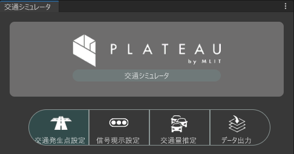

## 事前準備

PLATEAU SDK for Unity により都市モデルをインポートし、道路ネットワークの生成・整備を行っておく必要があります。

Unityのメニューバーから`PLATEAU`-`交通シミュレーション支援ツール`を選択し`交通シミュレーション支援ツール`ウィンドウを開き`交通集中発生点設定`タブを選択します。

## 利用手順

### ゾーンの生成

`自動生成`をクリックする、おおまかな街区ごとにゾーンと道路ネットワーク端部の交通集中発生点を自動で生成できます。

  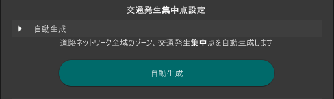

生成完了後、ゾーン（青色の形状）と端部の交通集中発生点（赤色の形状）が生成されます。

  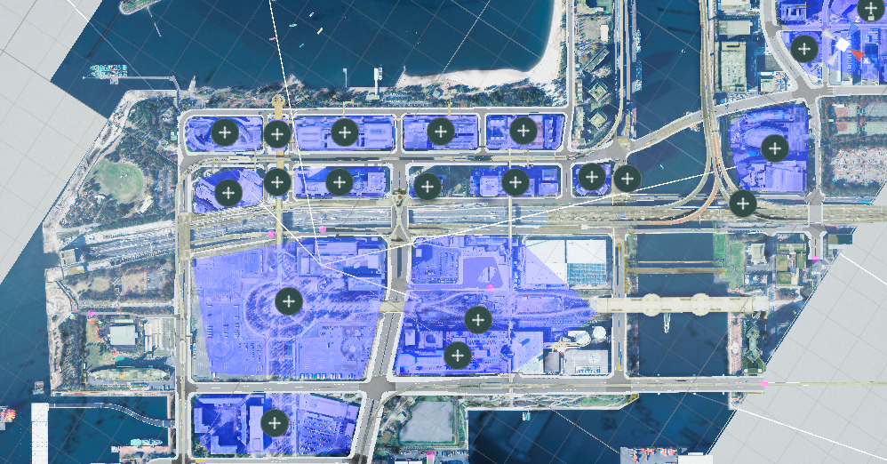

### ゾーンの選択

ゾーン上のアイコンをクリックすると、ゾーンが選択されてハイライトされます。

  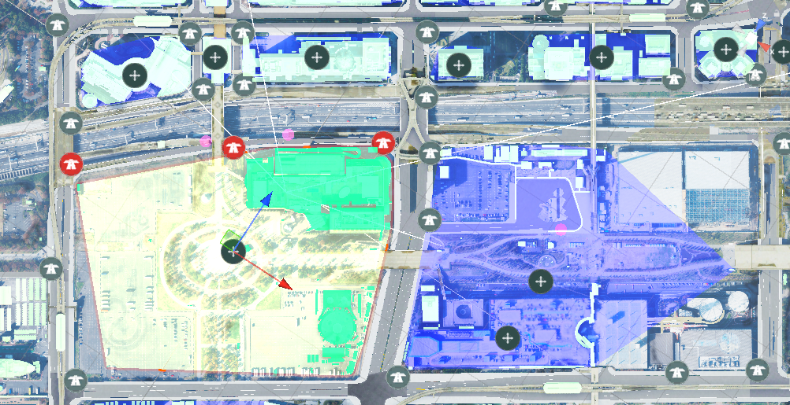

### ゾーンに属する建築物の登録・解除

ゾーンを選択し、ハイライトされた建物をクリックすると、ゾーンに属する建物を登録・解除できます。

- 登録中

    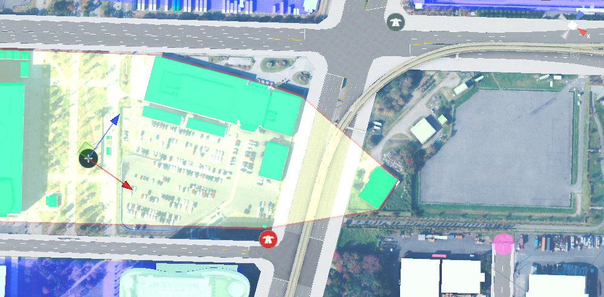

- 解除

    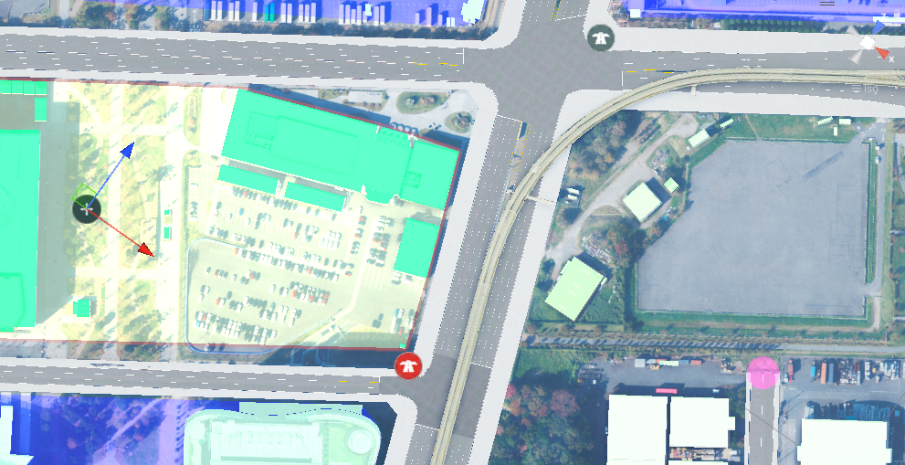

### ゾーンに属する交通集中発生点の登録・解除

ゾーンを選択し、交通発生集中点のアイコンをクリックすると、交通集中発生点を登録・解除できます。

- 登録中

    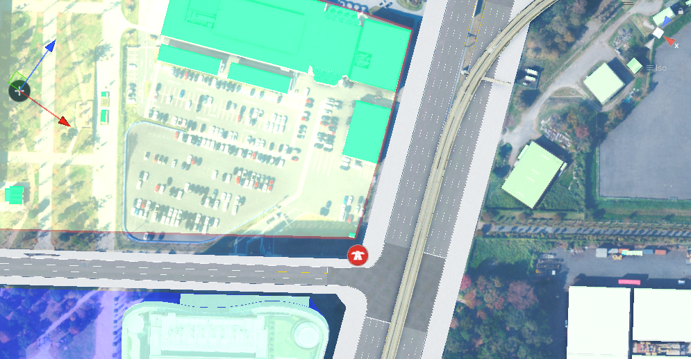

- 解除

    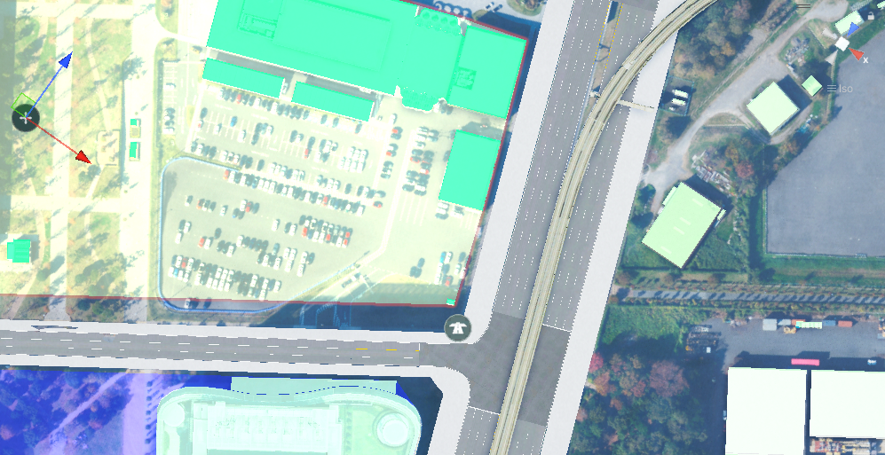

### ゾーン形状の編集

ゾーンの形状を変更するには`ProBuilder`を使用します。セットアップについてはUnityのページを参照してください。

ゾーンを選択します。

  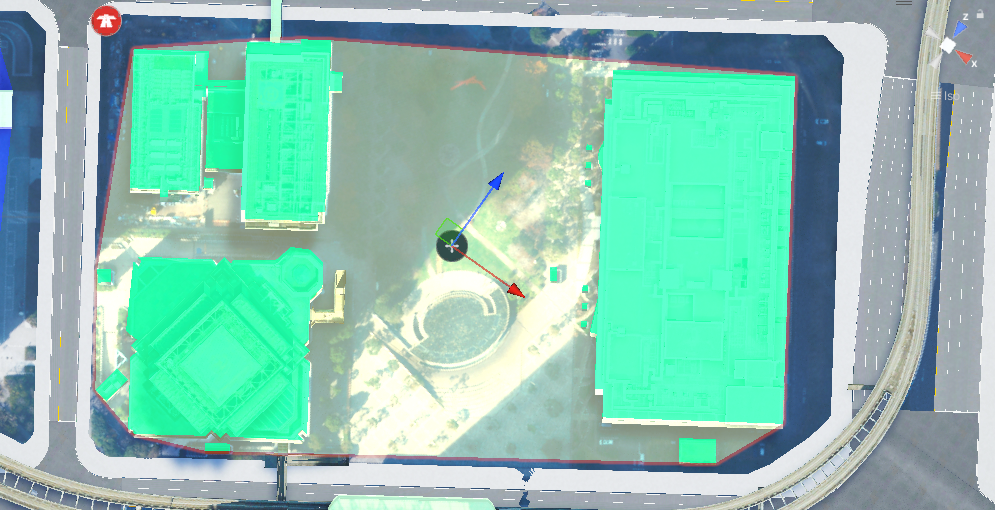

`ProBuilder`ウィンドウを表示し`Vertex Selection`を選択します。

  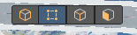

ゾーン外周の頂点にフォーカスすると操作点が表示されます。

  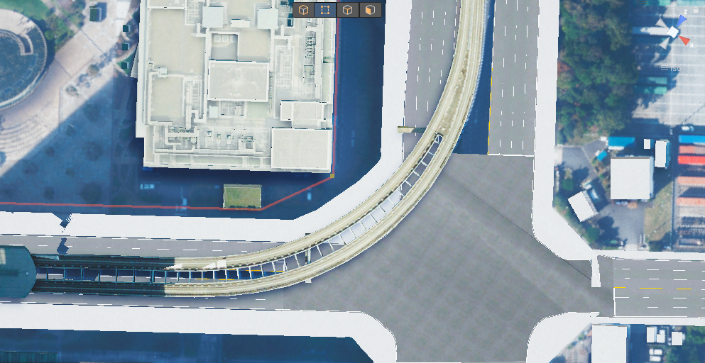

操作点をクリックするとギズモが表示され、移動することで形状を変更できます。

  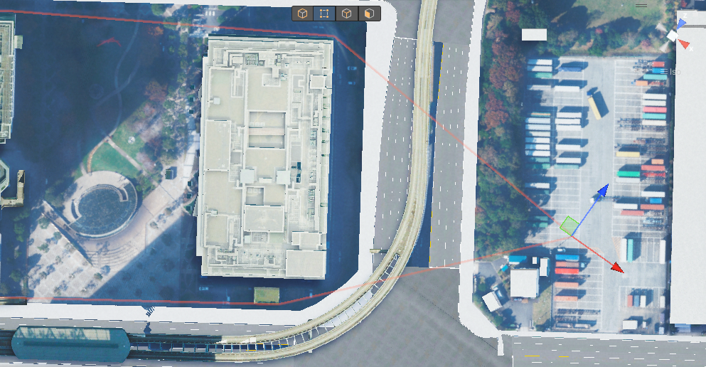

### ゾーンの結合

Ctrlキーを押下したまま複数のゾーンを選択します。

  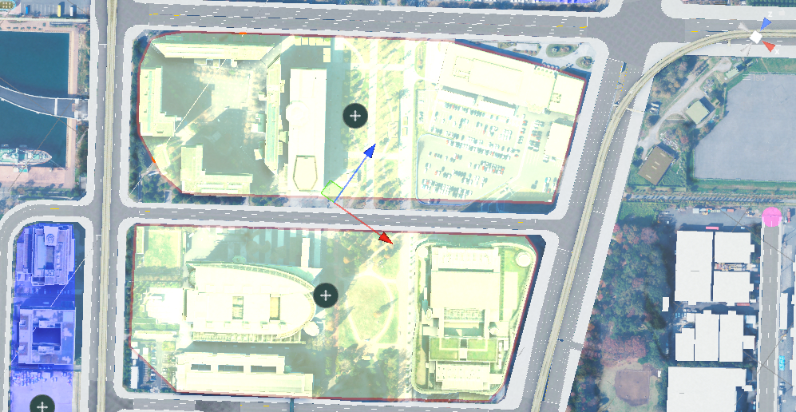

`結合`をクリックすることでゾーンを結合することができます。

  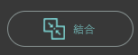

  

### ゾーンの追加

`追加`をクリックします。

  

ハイライトされた建築物を選択すると建築物の形状で新しいゾーンが追加されます。

シーン上で右クリックすると追加をキャンセルできます。

  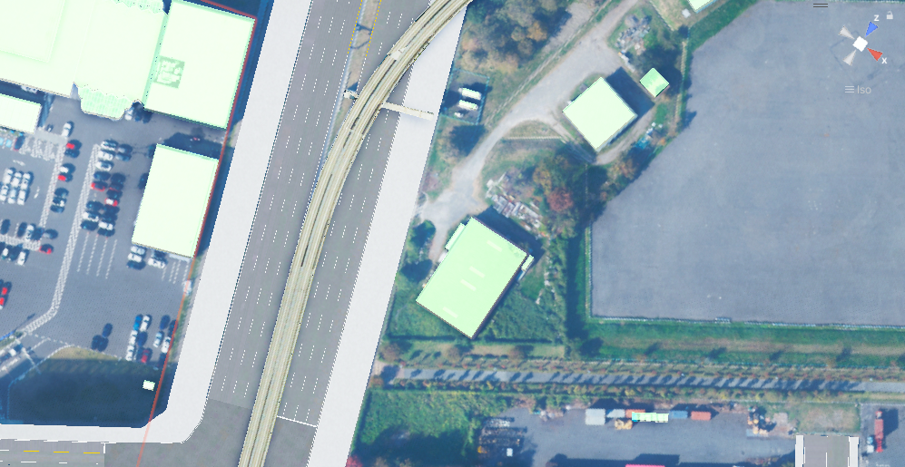

  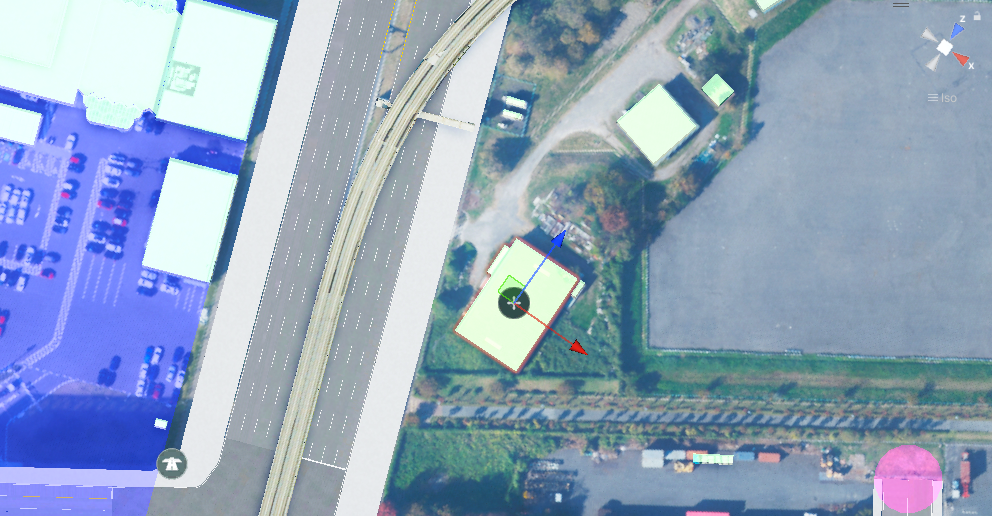

### ゾーンの削除

削除したいゾーンを選択します。

  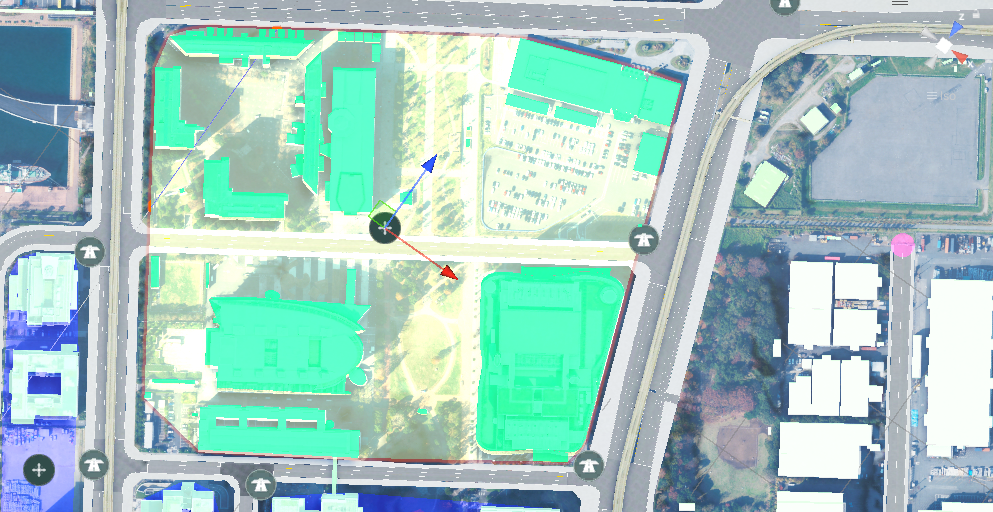

`削除`をクリックすることでゾーンを削除することができます。

  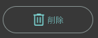

  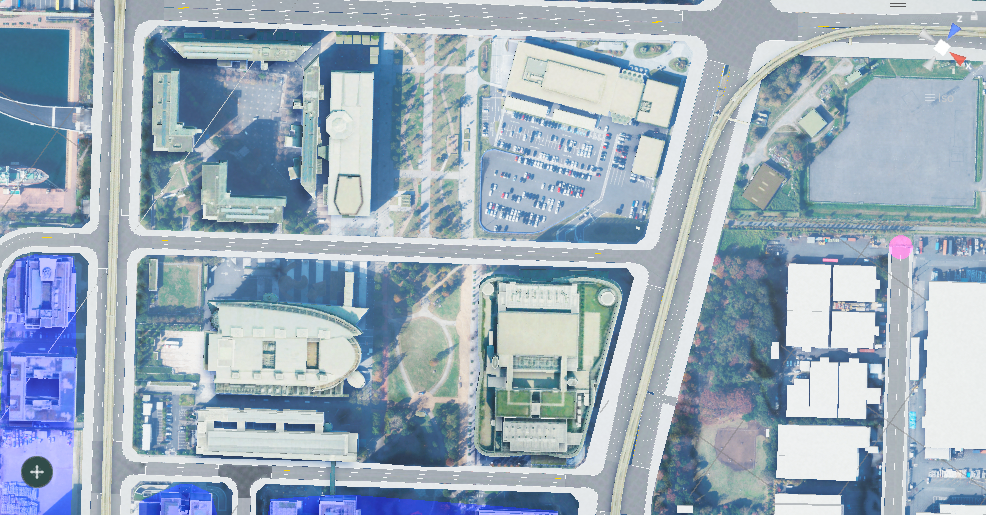